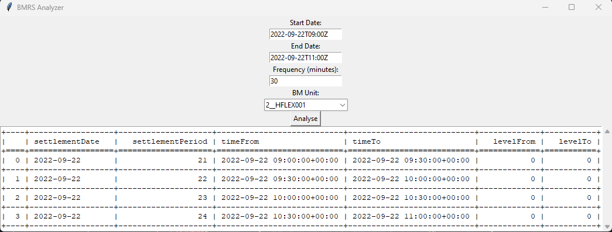
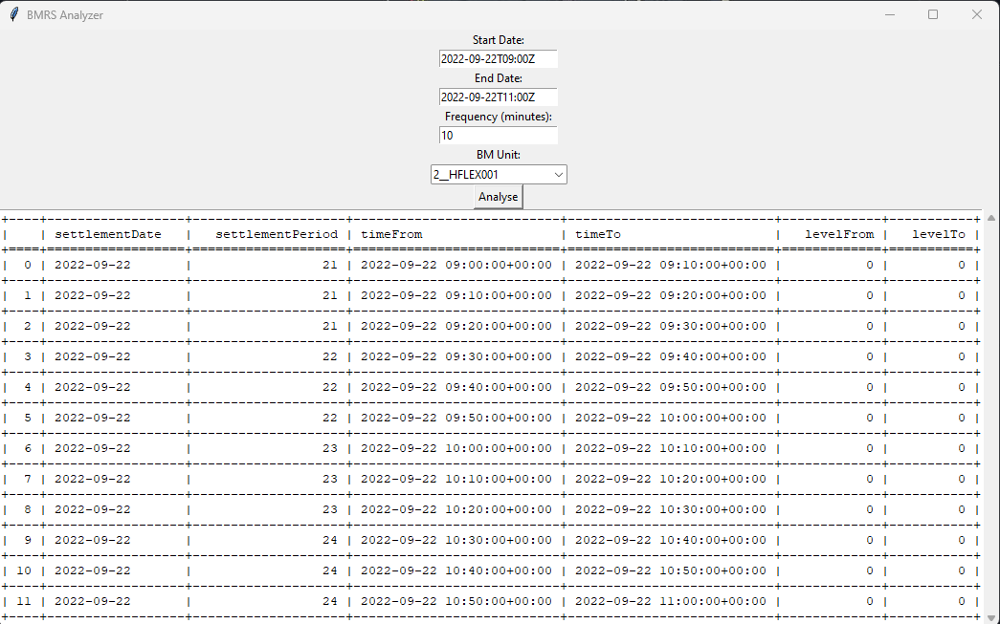

# This repo is my solution to H2GO Data Engineer Assignment.
The assignment has 2 parts

## Part 1:
Query the BMRS API for physical data and processes the
PN data to produce a clean output with this target frequency.

My soultion is a Python application (with Tkinter GUI) which accepts user parameters and then fetches the API and process the data to produce a clean output

The Python code can found in [BmrsAnalysis.py](https://github.com/raeez21/H2GO_REPO/blob/master/BmrsAnalysis.py)

Instructions:

Step 1: Clone this repo

Step 2: Create virtual env
`python -m venv bmrs_venv`

Step 3: Activate venv
`bmrs_venv\Scripts\activate` (windows)
`source bmrs_venv/bin/activate` (mac/linux)

Step 4: Install dependencies
`pip install requirements.txt`

Step 5: Run
`python BmrsAnalysis.py`

A tkinter GUI will be opened up. Input your parameters and wait for the processed output.

Screenshots below:

Frequency 30 mins

Frequency 10 mins

## Part 2
This was an EDA task on a generation data csv file. 
The EDA was done and is in [EDA.ipynb](https://github.com/raeez21/H2GO_REPO/blob/master/EDA.ipynb)
